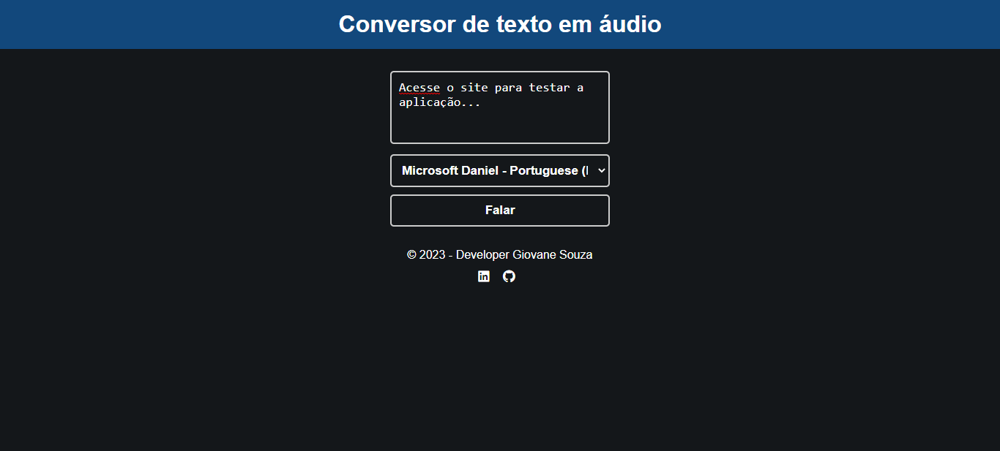

# text-speech-converter

Conversor de texto em áudio com recurso nativo do JS => Speech Syntesis.

## Tecnologias utilizadas

* HTML
* CSS
* JS

### Resultados obtidos

### Layout mobile (celular)

### Layout desktop

[Clique aqui para acessar a aplicação](https://giovanesouza.github.io/text-speech-converter/)